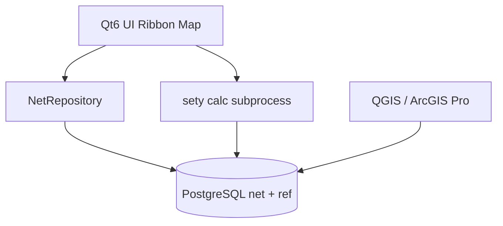

# Полная переписка: чистая GIS-БД + новое приложение

## Цель

1. **БД** — модель «одна таблица = один объект» (+ справочники). Без `nodes`/`linesobj` как контракта приложения.
2. **ГИС** — слои открываются **напрямую** в [QGIS](https://qgis.org/) и [ArcGIS Pro](https://www.esri.com/en-us/arcgis/products/arcgis-pro/overview) (PostGIS Query Layer / database connection).
3. **Программа** — **новое** приложение под эту БД (не compat-слой над старым gid8).
4. **Скорость** — быстрее текущей ТГИД: нет 26 JOIN при открытии схемы, тонкая загрузка карты, индексы, расчёт без лишних JOIN.

Уже сделанный мост (`tgid_gis` + compat + INSTEAD OF) — **этап миграции данных**. Он доказал модель `net.*`. Дальше — **продуктовый контур без наследия**.

---

## Принятые решения (по умолчанию)

| Вопрос | Решение | Почему |
|--------|---------|--------|
| Модель объектов | Уже есть: `net.*` + `node_reg`/`line_reg` | Единственный способ дать FK линиям при разных точечных таблицах |
| Справочники | Схема `ref` (копия нужных lookup/sprav) | Отдельно от объектов; без геометрии |
| Compat `public.nodes` | **Не входит в продуктовую БД** | Только для старого gid8 на переходный период |
| ArcGIS | PostGIS напрямую (Query Layers / DB connection). Enterprise Geodatabase (SDE) — **не** в MVP | SDE = лицензия Esri + другой жизненный цикл; для схем теплосети достаточно PostGIS |
| ArcGIS Online / Feature Service | Опционально фаза 3 через ArcGIS Enterprise или GeoServer | После стабилизации слоёв |
| Приложение | **Новый Qt6 desktop** (`tgid_app`), данные только через `net`/`ref` | Полный контроль UX ТГИД; переиспользование опыта gid8 без ADO/dual-ID |
| Расчёт | Python **sety**, чтение/запись **только `net` + calc** | Уже проверен; не тащить potr5 |
| SRID | Рабочий `geom` в **9998** (Almaty); для веб/OSM — `geom_4326` (generated/view) | Как в целевой модели |
| Координаты в UI | Только из `geom` | Никаких `x/y/coords` как SoT |

Если нужен именно **SDE / versioning** или **web-first** вместо Qt — это меняет фазы 2–3; напишите явно.

---

## Целевая структура БД (продукт)

```
tgid_prod
├── net/          -- объекты теплосети (1 тип = 1 таблица + geom)
│   ├── node_reg, line_reg
│   ├── consumer_real, pipe_section, damper, …
│   ├── fragment, heatsystem, …
│   └── calc_* или schema calc/  -- результаты режимов
├── ref/          -- справочники (диаметры, материалы, схемы b5, …)
└── meta/         -- layer_catalog для QGIS/ArcGIS, версии схемы
```

**Нет в продукте:** `public.nodes`, `public.linesobj`, `*_legacy`, typed-таблиц со старыми именами как SoT.

QGIS / ArcGIS Pro подключаются к `net.pipe_section`, `net.consumer_real`, … — каждая таблица = слой.

---

## Архитектура нового приложения



Модули `tgid_app` (новый код, не патч gid8):

| Модуль | Ответственность |
|--------|-----------------|
| `db/` | Подключение, транзакции, prepared SQL |
| `repo/` | CRUD по типу объекта (`pipe_section`, …), смена класса через reg |
| `map/` | Отрисовка из thin-query / WKB из `geom` |
| `calc/` | Запуск sety, просмотр `calc` |
| `forms/` | Карточки атрибутов по метаданным колонок |
| `auth/` | Пользователи/права (новая модель, не plaintext как сейчас) |

**Не переносим:** dual-ID (`id2`/`nodeID`), `us.sql` mega-JOIN, запись через compat views.

---

## Фазы

### Фаза A — Продуктовая БД (сейчас)

1. Скрипт сборки **чистой** БД: конвертация `almatygid` → `net`, копирование справочников в `ref`, **без** обязательного compat-switch для продукта.
2. `meta.layer_catalog` + представления `*_4326` для веб.
3. Проект QGIS (`.qgz`) со всеми `net` слоями.
4. Инструкция ArcGIS Pro: database connection → Query Layer по PK `id`, SRID 9998.

**Критерий:** инженер открывает `tgid_prod` в QGIS/ArcGIS и видит/редактирует трубы и потребителей без ТГИД.

### Фаза B — Новый data/calc контур

1. Адаптация sety: `read_gid` из `net.*` (без `nodes`/`linesobj`).
2. Thin SQL для карты (уже есть задел `070_map_thin.sql`) — встроить в новое приложение.
3. Регрессия расчёта (уже: frag 2 structural_ok) — расширить набор фрагментов.

**Критерий:** расчёт на `tgid_prod` без public-compat; скорость открытия схемы ≤ текущих ~210 мс и лучше за счёт thin map.

### Фаза C — Новое Qt-приложение (переписка UI)

1. Каркас `tgid_app`: карта, дерево фрагментов, карточка объекта, запуск расчёта.
2. Порциями: редактирование сети → паспорта/ремонты → ТУ/отчёты (по приоритету бизнеса).
3. gid8 остаётся read-only/legacy на `tgid_gis` с compat до завершения C.

**Критерий:** основной сценарий «открыть фрагмент → править → считать → сохранить» без gid8.

### Фаза D — Публикация (опционально)

Feature Service / GeoServer, мобильный просмотр, SSO.

---

## Скорость (обязательные меры)

| Было | Станет |
|------|--------|
| 26 LEFT JOIN подтипов | `UNION`/`FROM net.<type>` или thin 14 колонок |
| `coords` text SoT | только `geom` + GiST |
| Расчётные out в каждом load | отдельный запрос по требованию |
| Soft `removed=0` без partial index | `removed_at IS NULL` + partial indexes |
| String-built SQL | prepared statements / batch |

Ожидание относительно старого gid8+almatygid: **×3–5** на открытии фрагмента (уже частично достигнуто на net-read); thin map даёт ещё **×2–4** на отрисовке.

---

## Что уже есть (не выбрасывать)

- Схема и конвертер: [`converter/`](../converter/), [`sql/010_net_schema.sql`](../sql/010_net_schema.sql)
- Валидация, FK, восстановление геометрии
- Calc structural parity после фикса `regulator_press`
- Thin map SQL, бенчи

---

## Следующие конкретные шаги в репозитории

Готово:

1. `tools/build_clean_gis_db.ps1` — сборка `tgid_prod` (net+ref+meta, без продуктового compat).
2. `sql/100_gis_catalog.sql` — каталог слоёв и версия контракта.
3. Каркас `tgid_app/`: карта, карточка, конкурентное редактирование, архив,
   создание узлов/линий и серверная топология.
4. Нативное чтение основных классов `sety` из `net`.
5. Автоматическая инвентаризация старых функций и SQL:
   [12-legacy-function-inventory.md](12-legacy-function-inventory.md).
6. Базовые справочники `ref`, `meta.field_catalog` и выпадающие редакторы Qt,
   сохраняющие исходные идентификаторы справочников.
7. Контракт БД версии 8: каталог покрывает все поля 32 опубликованных классов;
   карточка группирует поля, проверяет числа и даты и поддерживает поиск в
   больших справочниках.
8. Контракт версии 9 и атомарное разрезание `pipe_section`/`line_plain`:
   контроль версии, сохранение атрибутов, топологии и истории.
9. Контракт версии 10 и безопасное соединение последовательных участков:
   блокировки строк, проверка общего узла, равенства атрибутов и степени узла,
   архивирование исходных объектов в одной транзакции.
10. Ctrl-мультивыбор на карте и атомарное массовое изменение до 500 объектов
    одного класса с контролем версии каждой строки и аудитом Qt/QGIS.
11. Универсальная вкладка типизированного поиска по 32 объектным классам:
    метадатные поля, справочные значения, диапазоны, NULL и открытие карточки.
12. Первый эксплуатационный отчёт: протяжённость `pipe_section` по всей базе,
    фрагменту или выделенным участкам, группировки и экспорт CSV.
13. Многополевой конструктор запросов: до восьми типизированных AND-условий,
    таблица условий в Qt и повторяемый параметр CLI.
14. Контракт версии 11 и перемещение узла из Qt: контроль версии, атомарное
    перестроение подключённых линий и аудит геометрии Qt/QGIS.
15. Контракт версии 12 и безопасная смена класса узлов и линий: сохранение ID,
    геометрии, топологии, общих атрибутов и непрерывной истории; отказ при
    риске потери заполненных полей.
16. Перенос запроса `aZap1 «Объём сети»`: точное воспроизведение старой
    формулы по объектной `net.pipe_section`, фильтры, группировки, выделение на
    карте и CSV без чтения `public.linesobj`/`public.heatpipesections`.
17. Перенос запросов `aZap3–aZap5`: агрегаты теплопотребления и расходов из
    последнего расчёта каждого фрагмента, режимы всех/закрытых/открытых систем,
    Qt и CSV по `calc.pt_out` с привязкой к объектным узлам `net`.
18. Перенос `aZap6 «Закрытые потребители»` и `public.externalcodes` в
    `ref.externalcodes`: точный список, фильтры, переход в карточку, CSV,
    lookup-редакторы и внешние ключи всех узловых классов.
19. Перенос `onPotNagr0 «С нулевой нагрузкой»`: исходные раздельные правила
    для реальных и обобщённых потребителей, точная совместимость с
    дополнительными subtype-строками, фильтры, карточка и CSV.
20. Перенос `onPotrOtkl «Отключённые потребители»`: отсутствие результата
    узла в последнем расчёте фрагмента, разделение причин «нет расчёта» и
    «нет PT_OUT», фильтры, карточка и CSV по `net`/`calc`/`ref`.
21. Перенос `onUtZakr «Закрытые участки»`: точное исходное условие закрытого
    состояния подачи и обратки, фильтры по фрагменту и узлам, карточка линии и
    CSV напрямую по `net.pipe_section`/`net.v_nodes`/`ref.externalcodes`.

Дальше:

1. Утвердить бизнес-статус команд из реестра: обязательная, опциональная,
   клиентская или устаревшая.
2. Довести основной редактор сети: отдельные бизнес-формы ключевых классов и
   дополнительные справочники.
3. Создать продуктовую схему `calc`, убрать запись `sety` в legacy `*_out`
   и встроить запуск расчёта в Qt.
4. Переносить запросы законченными сценариями с автоматическим сравнением
   результата старой и новой БД.

---

## Зафиксированный стек

- основной интерфейс — новый Qt6 desktop `tgid_app`;
- совместное редактирование — напрямую в PostGIS из Qt и QGIS;
- интеграция ArcGIS оставлена без изменений и не входит в текущий этап.
